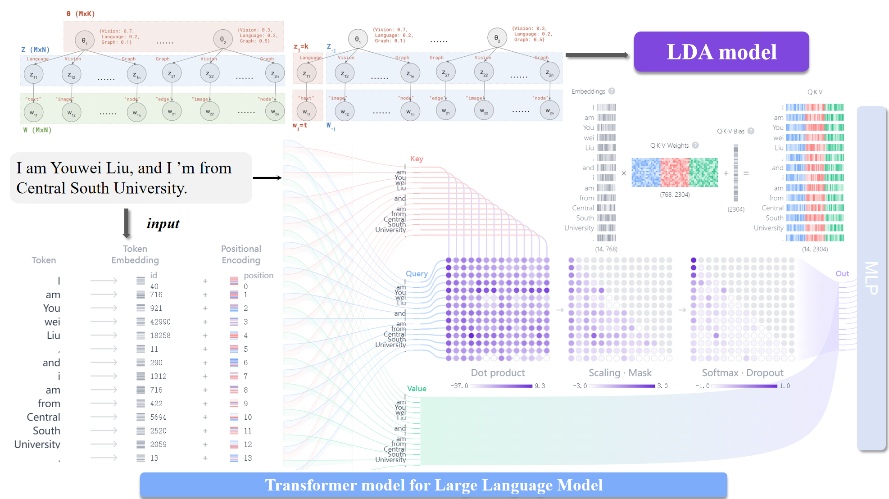

# LDA yet? Transformer is All You Need — Mini-LLM  
*26 M-parameter decoder-only model · NeurIPS LDA analysis*

> A compact Transformer that still talks like GPT-style models — and the journey from traditional **LDA** topic modelling to end-to-end **LLM** training.  
> 本仓库包含完整代码、数据处理脚本与检查点，帮助你从零复现报告中的全部实验。

---

## 任务块

| 模块             | 关键特性                                                                 |
|------------------|--------------------------------------------------------------------------|
| **LDA 分析**     | · 针对 **1 000** 篇 NeurIPS 论文抽取 **10** 个主题<br>· Gibbs 采样推断 + 关键词可视化 |
| **Mini-LLM**     | · **26 M** 参数，Decoder-Only 架构<br>· **RoPE** 位置编码，支持超长上下文<br>· **RMSNorm + SwiGLU + GQA**，显存 ↓ 40%，推理 ↑ 1.3–1.6× |
| **端到端流程**   | · 数据抓取 → 清洗 → 预训练 → 微调 → 推理<br>· 预训练困惑度 **1600 → 12**，微调后 **10 → 5.5** |

---

## 📂 项目结构

```
├── data/                 # 原始与处理后数据
├── src/
│   ├── model/            # Transformer 架构定义
│   ├── train.py          # 训练主程序（预训练与微调）
│   └── utils/            # 工具函数（RoPE, 评估等）
├── checkpoints/          # 模型检查点（预训练与微调结果）
└── notebooks/            # LDA 分析笔记本
```

---

## 🚀 快速开始

### 1. 创建环境
```bash
pip install -r requirements.txt
```

### 2. 下载/准备数据
> 由于训练数据集过大，需要请请邮件咨询：loyiv5477@gmail.com

### 3. 启动预训练
```bash
python src/pre-training.py \
  --config configs/pretrain.yaml
```

### 4. 进行监督微调
```bash
python src/full-SFT-train.py \
  --stage sft \
  --config configs/sft.yaml \
  --ckpt checkpoints/pretrain.pt
```

### 5. 推理示例
```python
from src.model import MiniLLM
model = MiniLLM.load_from_checkpoint("checkpoints/sft.pt").eval().cuda()
print(model.chat("讲讲 LDA 与 Transformer 的差异？"))
```

---

## 📊 实验结果

| 阶段     | 训练步数    | 交叉熵 Loss ↓        | 困惑度 ↓          |
|----------|-------------|----------------------|-------------------|
| 预训练   | 0 → 1 300   | 7.4 → **2.5 ± 0.15** | 1600 → **12.2**   |
| 微调 SFT | 0 → 4 500   | 2.3 → **1.70 ± 0.15**| 10.0 → **5.5**    |

---

## 📈 LDA 主题分布（NeurIPS）

<details>
<summary>点击展开查看 10 个主题关键词</summary>

- **Topic 0** Model construction & training  
- **Topic 1** Data-driven methods  
- **Topic 2** Optimization algorithms  
- **Topic 3** Deep architectures  
- **Topic 4** Bayesian methods  
- **Topic 5** Reinforcement learning  
- **Topic 6** Natural language processing  
- **Topic 7** Generative models  
- **Topic 8** Graph & structured data  
- **Topic 9** Visual / speech recognition  

</details>

---

## 📝 引用参考

如果本项目对你的工作有帮助，欢迎引用：

```bibtex
@report{liu2025lda_transformer,
  title  = {{LDA yet? Transformer is All You Need}},
  author = {Youwei Liu and Wen Shi},
  year   = {2025},
  note   = {Central South University, Technical Report},
  url    = {https://github.com/loyiv/mini-LLM}
}
```

---


## 🙏 致谢

本项目由中南大学刘又玮自主完成，感谢施文教授《文本分析与文本挖掘》课程的悉心指导与启发。
